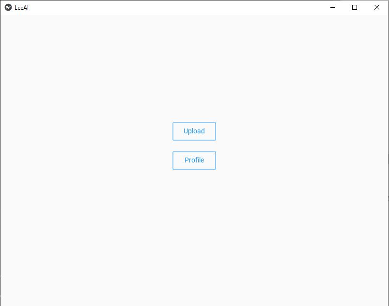
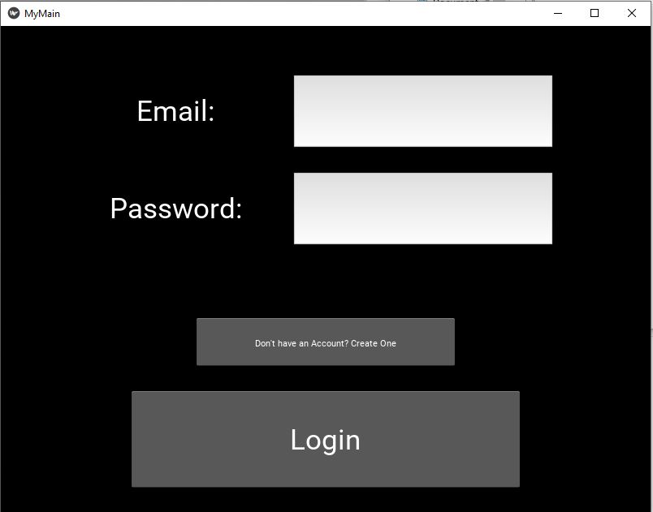
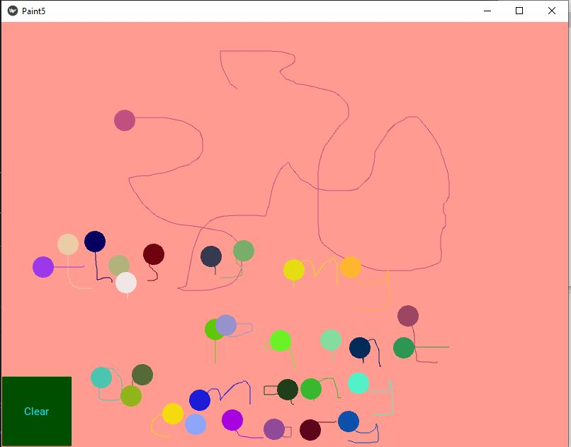
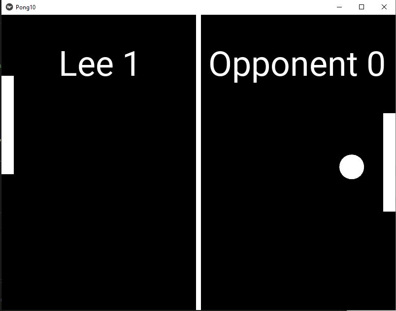

# Kivy
Python framework for developing cross-platform apps with a standard user interface

developers to build cross-platform applications that can run on various operating systems such as Windows, macOS, Linux, Android, and iOS.

Kivy provides a range of features and tools to make application development faster and easier. It includes a set of widgets and layout managers for designing the user interface, as well as support for multimedia, animations, and touch input. Kivy also includes a built-in language for designing user interfaces called Kivy Language (KV), which allows developers to design interfaces declaratively using a markup language.

***
### 1. Create a System Upload Page

*** 
### 2. Create a Multi-Page Database Login System

***
### 3. A paint-esque app development for writing, drawing and colorful annotations

***
### 4. Game App - A Ping Pong game Dev

